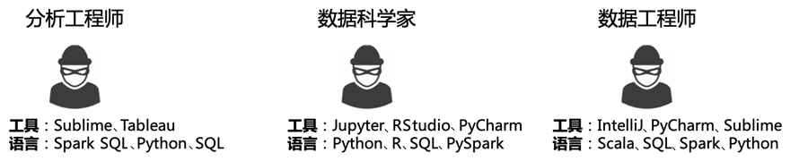
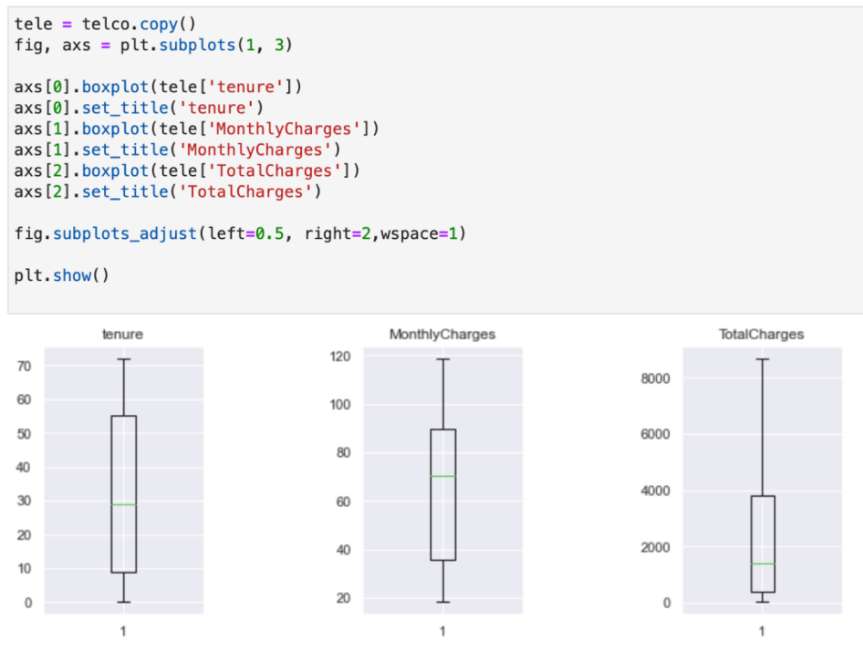

# 【转载】机器学习：从开发到上线
原文：
机器学习：从开发到上线
https://mp.weixin.qq.com/s/KTMKYXAv0csH45LANXpf9g

本文主要介绍机器学习（以下简写为ML）算法和架构在MLOps框架下的工程实践。

当从业者具备了足够丰富的知识储备时，就可以开始尝试ML了。

通常情况下，ML实践会涉及研究和生产两个主要环境。

研究环境可以在本地计算机或工作站上，这通常是为了进行小规模的模型分析和探索。

生产环境是模型投产的环境，ML在生产环境中通常需要相对长期的持续运行，生产环境中的任务一般需要自动化和持续迭代。

下面举个仅需要在研究环境中进行数据分析或建模即可满足需求的例子，即在文章标题中找到与较高点击率相关的关键词。数据分析师的交付方式可能是将探索出的规律和结论报告给一个运营团队，这样运营人员就可以在新的标题中尝试使用探索出的规律和结论来提高点击率。

再举一个数据分析和建模需要在研究环境中完成而建模结果需要在生产环境中发布的例子，该情况下的模型需要不断迭代，比如在电商网站上运行的推荐模型。在生产环境中运行的模型会涉及后续的管理和运维，当运行中出现异常或模型衰退时，需要通过监控机制发出预警信号。

这两类环境对从业者的要求很不相同。大多数初级ML图书讲述的是研究环境中的ML，很少会涉及生产环境中的ML。《MLOps实践――机器学习从开发到生产（全彩）》一书的重点将放在生产环境中。

一般来说，一个完备的ML项目的工作流程是，先在研究环境中探索和开发ML模型，制作一个ML应用程序的原型，然后符合预期的模型会被推送到生产环境，进行自动化部署和监控。开发一个用于生产环境的ML应用程序的工作比分析、探索的工作要复杂得多，需要把在研究环境中运行的ML作业转换成能在生产环境中自动运行的作业，我们通常把这一过程称为ML的生产化或工程化。

## 机器学习工程及生产化模块
回顾前面ML的定义，从广义上讲，ML是一门通过算法和统计模型从数据中学习知识的学科，ML工程顾名思义就是构建基于ML的应用程序的计算实践。

ML工程是建立在ML的工作基础上并将研究环境中开发的ML模型应用于生产环境的技术。ML工程与ML的区别在于侧重点不同，ML更关心算法的优化和模型的训练，ML工程则更关心从不同业务系统采集数据，并训练一个兼顾模型性能和计算性能的模型，使其能在生产环境中稳定运行，保证模型的可监控、可维护、可更新、可被业务系统使用，为模型生产化提供工程保障。

ML工程包括从数据收集、特征工程、模型训练到模型投入应用、管理和运维的所有阶段。这个过程与高中时期考试的不同阶段类似，ML开发过程相当于平时的模考，关心的是对知识点的消化和总结，ML工程相当于高考，在兼顾平时模考习得的知识点的同时，还需要综合考察实考环境下的心理压力、时间分配、考题内容等因素。

事实上，数据科学团队通常专注于研究新颖的算法或训练高精准的模型，但与实际ML项目中需要的全流程（如特征工程、部署、监控等）相比，ML算法只是ML项目非常小的一部分，一个真正要投产的ML项目通常需要大量的工程工作和基础设施的配合，以实现ML模型在生产环境中顺利运行。

2015年，谷歌发布的论文指出，为了避免无休止的“技术债”缠身，应该强调将ML生产化视为一门学科的重要性（在当前的ML技术主流中确实如此），通过加强工程技术的投入来顺利实现ML的生产化。如图1所示，ML模型的生产化是由多个模块组成的，在实际场景中需要在这些模块间建立沟通机制来配合完成ML模型的生产化。

  
`图1  ML生产化模块`

## 机器学习工程模块的设计原则
关注点分离（SoC）是一个可行的设计原则，指的是计算机科学中对应用程序、代码块和其他对象系统进行划分的方式，关注点被“分离”的程度因系统而异。比如，一个存在相互依存关系的系统一般是关注点的弱分离，简称弱分离；而一个可以完全独立负责自己工作的系统或模块，一般认为是关注点的强分离，简称强分离。

ML 工程模块的设计既可以使用弱分离的设计原则，也可以使用强分离的设计原则。在弱分离的设计原则下，训练和预测必须在同一台服务器上运行，训练步骤和预测步骤被捆绑在同一个模块中。比如，在输入数据上调用一个名为train的函数，该函数返回一个模型，该模型会作为predict函数的输入，在运行时会按顺序依次执行train和predict函数。而在强分离的设计原则下，训练和预测可以在两个不同的服务器或进程中运行。在这种情况下，训练和预测是相互独立发生的，训练步骤和预测步骤分别归属不同的模块。

一般来说，面向服务的架构（SOA）是符合强分离设计原则的，我们认为在生产场景下使用SOA来设计和开发ML系统是可行的。

此外，无论是设计MLOps平台还是传统的ML系统，建议在设计时考虑以下几项关键原则。

```go
* 从一开始就为可重复性而构建：保留所有模型的输入和输出，以及所有相关元数据，如配置信息、依赖项、操作时间戳等。注意版本控制，包括所用的训练数据。

* 将ML过程中的不同管道视为系统的一部分：如特征工程、自动化训练、模型部署和发布等。

* 提前考虑可扩展性：如果系统需要定期更新模型，则需要在设计系统的时候就仔细考虑如何做到这一点。

* 模块化：尽可能地对ML生命周期的各个环节进行模块化，这会极大地提高系统的复用性。

* 测试：需要预留一定的时间来测试ML的应用程序，包括模型、数据及代码等不同类型实例的测试。
```

## 进行机器学习工程的模块设计时需要注意的细节
设计架构和模块的出发点应该是满足业务需求和公司更长远的目标。在开始设计和使用最新技术之前，需要了解现有条件的限制、预期会创造的价值及在为谁创造价值等，需要考虑当前公司的业务场景及未来可能会新增的场景。比如，在现有的业务场景下是否需要提供实时预测？如果需要实时预测，那么业务侧允许的延迟是毫秒级的还是秒级的，又或者只需在接收输入数据后的30分钟或一天内交付预测结果就能满足需求。

具体地，以下几个细节值得考虑。

```go
* 针对公司业务，希望多久更新一次模型？

* 预测的需求（流量）是什么？

* 需要处理多大量级的数据？

* 希望使用哪些算法？比如，是否会使用深度网络类的算法（需要评估是否真的需要）？

* 是否处在一个对系统审计要求非常高的监管环境中？

* 当前要设计的ML系统是在之前的基础上升级的还是重构的？

* 当前的工程团队有多大？是否包含了数据科学家、ML工程师及DevOps工程师等？当前团队是否有开发ML系统的经验？

```

一旦团队对这些基础问题进行了评估，便可以在此基础上考虑ML系统的一些高级体系结构选项，比如，打造独立的模型训练系统、模型服务系统，抑或全流程的MLOps平台。

需要注意的是，为了避免从业者在使用上混淆“系统”和“平台”，这里对二者的定义进行说明。

系统通常指的是一个具体的软件，而平台则是指进行某项工作所需的信息化环境或条件，是一个相对抽象的生态环境。系统强调的是功能，平台侧重的是场景。系统有明确的输入、处理过程和输出，而平台则是基于同一套规则和体系，由多个主体共同参与的生态圈，这套规则和体系往往是由系统组成的。

## 编码环境与模型探索
如果数据科学家在研究环境中使用的编程语言与生产环境中的一致，那么整个工作流程的处理会轻松一些，这里涉及的编程语言通常是Python语言，因为它拥有丰富的关于数据科学和数据处理的开源代码和包。然而，如果运行速度是一个要考虑的选项，那么Python语言可能是不可行的（尽管有很多种方法可以帮助其进一步优化运行速度）。

出于性能的考虑，何时进行语言的转换变得格外重要，因为研究团队和生产团队之间的额外沟通成本将会成为一个很大的负担。当然，如果你周围所有的数据科学家都精通Scala、Java或C++语言，那么这个问题就变得简单多了。

当然，不同的角色可能会使用不同的工具或编程语言，没有一个工具可以涵盖所有任务，更重要的是，单个任务通常需要多个角色和多个工具来协作实现。以分析工程师、数据科学家和数据工程师为例，如图2所示，数据工程师可能会使用IntelliJ中的Scala创建包含数亿个事件的数据集的聚合，分析工程师可能会在相关业务的分析报告中使用SQL和Tableau对该聚合进行分析和可视化，而数据科学家可能会使用Python处理该聚合并参考分析工程师的分析结果进行线上营销模型的构建。


`图2  工具和编程语言偏好因角色而异的示例`

从表面上看，这三种角色的工作流程看似不同，但其实他们的工作内容通常是互补的，不同角色所负责的工作流程中的任务也会有重叠，为了进一步促进团队间合作，我们希望尽可能减少平台需要支持的工具的数量，在这些工具和语言的上层添加一层抽象，以提供跨工具和编程语言的通用模式，这也是MLOps的理念。

幸运的是，有一个开源项目Jupyter（该项目也是当前数据科学家最常用的开源项目之一）的设计做到了这一点。当前市面上很多专攻MLOps领域的公司都是使用Jupyter来提供建模或分析环境的，如cnvrg.io、Domino Data Lab、InfuseAI等。其中InfuseAI公司旗下的PrimeHub平台最初就是从提供在线Jupyter建模环境开始的，后来才慢慢增加了模型部署和管理等功能，并逐步扩展成为MLOps平台。

Jupyter提供了一个标准的消息传递API协议与充当计算引擎的内核进行通信，该协议启用了一个可组合的架构，将编写代码内容的位置（UI）和执行代码的位置（内核）分开。通过将运行时与UI界面隔离（实际上MLOps的设计也借鉴了类似的思路），Jupyter可以跨越多种编程语言，同时保持执行环境配置方式的灵活性。

具体地，随着新的ML开发框架不断兴起并取代传统工具，不建议对MLOps平台支持的语言或框架制定限制性的标准。MLOps平台的设计应该足够灵活并模块化，以支持添加新框架，比如，需要能够随意加载TensorFlow、PyTorch和Scikit-Learn这些数据科学家必备的工具或框架。不过在MLOps框架内搭建Jupyter环境时要注意一点，需要按用户或项目生成隔离空间，比如，将新增的Jupyter服务创建在Python的虚拟环境中，或者使用容器进行创建，因为不同的项目或不同的用户可能会使用不同版本的ML工具或框架。

当我们准备开发一个可能在生产中运行的ML原型时，我们喜欢使用一些可视化的开发工具，如Jupyter。从业者可以在Jupyter中编写代码的同时撰写模型说明和数据探索的结论。

与使用开发工具或老式的文本编辑器和Shell终端相比，Jupyter的关键优势在于，它提供了数据可视化的功能，可以在线显示分析图，为待打印的数据框架提供良好的显示格式，如图3所示。这使得开发者在写脚本的时候可以很容易地检查中间结果，这种方式比把输出内容打印到终端或在断点处检查变量更直观、高效。


`图3  Jupyter Notebook中数据帧的基础可视化`

数据探索是任何ML项目的第一个具体的、手动的步骤，通常也是从业者最熟悉的步骤。但当将一个ML项目推进到产品化阶段时，往往会产生认知偏差，因为这两个阶段需要不同的工具和思维方式。

没有数据就没有模型，所以数据探索很自然地应先于模型探索。数据探索的目的是理解数据。准备数据的时候使用的原始数据通常是以表格的形式保存的，这时无法直接对数据进行探索，因为一个可能有百万行数据的表格并不是人类可以理解数据的最佳界面。我们擅长的是用形状、尺寸和颜色等来理解事物。为了理解单个变量的属性及多个变量间的关系，人们需要借助工具。理解数据时可以使用特征工程技术将数据转换和处理为更高层次的特征，这些特征在模型探索步骤中将会起到关键作用。

模型探索可以与数据探索重叠，但也可以认为它是一个独立的步骤。在模型探索步骤中，数据科学家会分析和评估不同模型的可行性，如评估使用回归、决策树或随机森林等算法在现有数据上的表现。

在技术层面，模型探索比数据探索有更高的要求。模型探索时经常使用Jupyter，数据探索通常可以在本地Jupyter环境中完成，而模型探索步骤一般有更高的计算要求。用一组参数和数据测试一个模型的表现，有时需要几个小时，甚至几天，一个可自动扩展的云环境可能会成为合理的选择。模型探索既要花费时间又要花费金钱，所以版本控制和可重复性对于所有的探索实验来说都是必要的。

此外，随着ML项目的不断增加，撰写模型文档也成为数据科学家开发模型不可或缺的环节，在MLOps平台内嵌Jupyter后，数据科学家不但可以使用相关功能进行模型的训练和部署，而不必关心底层资源的管理，还可以在Jupyter内轻松撰写数据探索和模型建模过程，形成知识库，以在整个团队内共享。

在完成了数据探索和模型探索后，如果需要将模型或分析结果生产化，那么还有很多工作要梳理和实现。比如，生产中的数据在哪里？如何在现实场景中使用模型的结果？是否需要将模型部署到分布式的机器上来扩大规模？模型服务的预测延迟是否足够低？如何更新模型？如何知道模型是否有问题？如何处理边缘案例，如数据缺失和异常值的情况？本书接下来的章节将试图回答所有这些问题。

## 特征存储
在ML项目中，通常需要与许多类型的数据源打交道，这是因为没有一个数据源适合所有的应用。数据库对于存储大量的数据是极方便的，但在返回结果时相对比较慢，因为它们是从磁盘中读取数据的，而读取时间或磁盘的I/O通常会限制网络应用的性能。一些对延迟时间有要求的应用可能需要寻求方案来解决这个瓶颈问题，一种常用的方法是使用缓存，即将常用的数据存储起来，使其保存于内存中并随时可用，而不是从磁盘中“分页”提取。

具体来说，数据存储的方式有多种，如数据湖、数据仓库、数据集市及最近几年在ML领域比较火的特征存储等。它们代表了不同级别的数据管理方式。

```go
* 数据湖：非结构化原始数据的通用存储装置，如日志、图像、电子邮件及结构化的数据字典等数据适合使用数据湖。原始数据到数据湖的输入过程不需要过滤任何东西，因此数据湖的大小会不断增长。

* 数据仓库：处理过的数据、建模和结构化数据的存储装置，企业通常使用数据仓库来存储和检索运营指标、业务指标等。数据仓库通常是企业级的，能为整个企业各个部门的运作提供数据决策支持。

* 数据集市：一个简单的数据仓库，数据集市通常是部门级的，用来满足特定部门和用户的需求，按照多维的方式进行数据存储，包括定义维度、需要计算的指标及维度的层次等，从而生成面向决策分析需求的数据立方体。

* 特征存储：数据仓库的一种特殊形式，帮助数据科学家访问数据和管理ML的特征。它包含的特征是经过处理的数据，可以被ML模型直接消费。与数据仓库不同的是，特征存储提供了检索稳健性更高和延迟更低的访问渠道，以实现快速推理（预测），以及为频繁的模型持续训练过程提供训练数据。
```
特征存储好比数据科学的数据仓库，它的主要目标是使数据科学家能够缩短从数据摄取到ML模型训练和推理的时间，填补了MLOps生命周期中的一个重要空白。

在特征存储模式下，收集数据并将其转化为特征的过程是一次性完成的，并可以被重复使用。特征存储是将特征工程的过程与特征的消费（例如，在模型的开发或在线推理时使用）过程解耦，在特征存储中，特征在模型训练和在线推理服务之间的消费也使用了不同的技术进行分离，并通过一个通用的SDK来保持这两种消费模式的一致性。这种共享方式加快了ML的工作进程，因为数据工程师不必像传统方式那样每次建模的时候都重新收集数据和进行相应的转换，而重复性的工作会造成浪费，也不利于特征的充分利用和管理。此外，通过特征存储还可以选择历史沉淀下来的特征来快速生成训练数据以训练不同的模型。

特征存储的作用是双重的，它是对特征工程产生的特征进行存储的设施，也是开发者可以复用特征的存储设施。本质上，特征存储是人们共享、注释、发现和使用处理过的数据的地方。具体地，特征存储涉及两个不同的存储方式，一个是低延迟的在线存储，通常以Redis缓存的形式为模型服务提供最新、实时的特征，另一个是成本优化的离线存储，用于存储支持模型训练的历史数据。

当前市场上流行的特征存储有Michelangelo Pallete（Uber）、Feast（Gojek和Google）、Zipline（Airbnb）和Hopsworks（LogicalClocks）。

## 实验管理和模型管理
实验管理和模型管理都与ML模型的迭代、版本化及评估等关键事件息息相关，应确保可重复性，并提供模型和结果的可视化管理界面。

对模型训练期间产生的特定信息，如变量、特征、属性、评分、性能指标、历史版本及位置信息的管理属于实验管理的范畴。

而对训练、创建、部署、重新评估、重新训练、发布到生产环境及模型版本、标签和描述之类的事件的管理都属于模型管理的范畴。这些事件的标签可以是注释，如项目、用户、时间戳和有关原始值与更新值的详细信息。

实验管理与模型管理的实现通常需要将与数据科学家工作流程相关联的元数据进行记录和保存。这里的记录和保存可以通过API的封装来实现。除了通过API与元数据集进行编程交互，还需要有前端界面的功能来实现可视化管理，在前端界面上进行操作时所产生和检索的数据也是通过上述API来实现与后端数据库交互的。

## 服务
服务是一个更大系统中的独立单元，提供一些特定的功能。服务可以被认为是构成一个系统的黑盒子。举个例子，一个大型媒体网站的后端系统可能是由若干个共同为媒体网站的用户提供文章推荐的服务组成的。其中，一个服务提供一组关于一篇文章的统计数据，另一个服务可能会启动ML训练作业，并将训练好的模型提供给一个对ML结果进行后处理的服务，记为ML推荐服务，最终网站的前端调用推荐服务获取推荐结果。

这些工作通常被称为服务，每个独立的服务都是强分离的。虽然不同企业定义的服务标准各不相同，但还是有共性的，如下所述。

```go
* 服务是黑盒子，它们的实现逻辑对用户是隐藏的。

* 服务是自主的，它们要对它们所服务的功能负责。

* 服务是无状态的，要么返回预期的值，要么返回一个错误信息。当返回错误信息时，需要能够在不影响系统的情况下重新启动一个可用的新服务。
```

服务应该是可以复用的，这对MLOps平台来说特别有用，比如，特征存储的在线服务就是可复用的，可以满足不同团队和不同模型的使用要求。

## 模型服务规模化
在生产环境中，在模型服务化（服务化后产生的服务被称为模型推理服务或预测服务）阶段，其对应的API通常需要处理大量的请求负载，很多时候单机很难满足需求。有许多种方法可以扩展一个生产系统。

第一种方法是垂直扩展，指的是增加网络中单个节点容量的过程。如果模型服务已经在多个节点上运行，它指的是增加一部分网络或整个网络的容量。垂直扩展的主要问题是，随着单个节点容量的增加，与增加第二个类似规格的节点相比，它的成本会非线性地增加。垂直扩展通常是首选的方法。一般来说，这种方法在扩展时不需要修改代码。

第二种方法是水平扩展，即添加更多的节点到网络中，在节点之间分配容量。这种方法通常需要引入负载均衡器，该负载均衡器将一个给定的请求分流到一个（可能）当前不忙的节点。同样，这种方法在扩展时也不需要改变应用程序的代码。不过，与垂直扩展相比，它会带来更多的复杂性，因为要引入负载均衡器和增加网络规模。

除了这两种扩展方式，还有其他很多方式可以优化生产系统的性能。最常见的方式是，优化应用程序代码本身的性能，比如，寻找方法使代码片段处理得更快、分批进行数据库的调用、避免不必要的循环和嵌套，以及将网络调用做成异步的等。有时，我们还需要在低延迟和准确性之间找到一个折中的方案。在使用这些方法调整模型服务之后，模型服务的响应会变得更快。

此外，为了优化模型服务组件（模块）的成本，托管技术的选择至关重要，比如，在容器中运行多个模型可以最大限度地利用资源（CPU/GPU的内存）来处理推理请求。模型服务组件本身应具有模型生命周期管理的功能，以支持版本的推出。自动扩展是MLOps底层基础设施的一个重要特性，用于满足高峰时段的需求及降低非高峰时段的成本。比如，对长时间没有接收到流量的模型，可以灵活降低对该模型服务的资源分配。

## 模型监控
生产环境中的模型可以在正常运维范围内运行，通过监控组件的可视化指标进行观察。当模型的运行行为发生变化时，需要引入持续训练机制来解决模型的漂移问题。

前面讨论过，ML 管道包括传入数据的验证、模型评估、推理请求的监控和日志管理等任务，这些任务中的每一个都是管道中的独立组件。管道中每个组件产生的结果需要存储在中央存储中，以确保模型生命周期的可观察性。

通过验证和评估的开发环境中的模型，在推送到生产环境后，其实时性能需要由专门的监控模块进行跟踪，以确保对业务的影响正向。可以通过多种方法来监控运行中的模型服务和预测行为。理想的方法是，记录模型服务被请求时所做的预测，然后将它们与后续业务系统运行过程中观测到的用户反馈结果结合起来，最后评估运行中的模型性能是否满足预期。

```本文节选自《MLOps实践――机器学习从开发到生产（全彩）》一书，欢迎阅读本书了解更多相关内容！```


cnvrg.io
https://github.com/cnvrg

Full Stack Machine Learning Operating System | cnvrg.io
https://cnvrg.io/

cnvrg.io 架构 | 设计指南 — 通过 Dell Technologies 的 MLOps 优化机器学习 cnvrg.io | 戴尔科技信息中心
https://infohub.delltechnologies.com/l/design-guide-optimize-machine-learning-through-mlops-with-dell-technologies-cnvrg-io-1/cnvrg-io-architecture-4/

cnvrg.io – Hanaco
https://hanacovc.com/companies/cnvrg-io/

InfuseAI - Makes AI workflow 10X faster
https://www.infuseai.io/

Domino Data Lab | Unleash Data Science at Scale
https://domino.ai/

Enterprise Data Science Platform | cnvrg.io
https://cnvrg.io/enterprise/

Introduction to Data-Centric AI
https://dcai.csail.mit.edu/

Graft - Data-Centric AI with Foundation Models: A Practical Guide
https://www.graft.com/blog/data-centric-ai-with-foundation-models

Data-centric AI: a complete primer | Snorkel AI
https://snorkel.ai/data-centric-ai-primer/

Can we share models if sharing data is not an option?: Patterns
https://www.cell.com/patterns/fulltext/S2666-3899(22)00228-8#%20

Can we share models if sharing data is not an option?
https://www.cell.com/action/showPdf?pii=S2666-3899%2822%2900228-8

About - Zexi Li 李則熹
https://zexilee.github.io/about-zexili/
