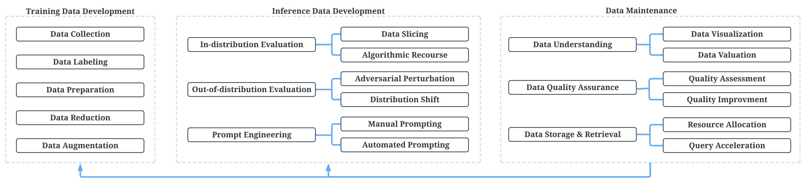

# 【翻译】以数据为中心的AI：前景和挑战
原文：
Data-centric AI: Perspectives and Challenges
https://arxiv.org/pdf/2301.04819.pdf

数据在构建AI系统中的作用最近被新兴的以数据为中心的AI(DCAI)概念大大放大，该概念主张从模型改进到确保数据质量和可靠性的根本转变。虽然我们的社区在不同方面不断投入努力来增强数据，但它们往往是针对特定任务的孤立举措。为了促进我们社区的集体行动，推动DCAI的发展，我们制定了一个大蓝图，并将三个主要任务结合在一起：训练数据开发、推理数据开发和数据维护。我们提供了关于代表性DCAI任务的顶级讨论，并分享了观点。最后，我们列出了开放的挑战。更多的资源总结在[作者的GitHub](https://github.com/daochenzha/data-centric-AI)中。

## 介绍
数据是AI系统不可或缺的元素。最近，它的作用被新兴的以数据为中心的AI(DCAI)概念大大放大，如图1左侧所示。DCAI的普及主要是由Ng等人发起的一场以数据为中心的运动推动的[23]，该运动倡导以数据为中心而不是以模型为中心的机器学习策略，从模型设计到数据质量和可靠性的根本转变。

`图1：左：近5年DCAI趋势。这些统计数据是通过在谷歌学术搜索中搜索完全匹配的短语“以数据为中心的AI”来收集的。右图：以模型为中心的AI vs. DCAI。`

图1的右侧说明了以模型为中心的AI和DCAI之间的高层比较。在传统的以模型为中心的生命周期中，基准数据集基本保持不变。研究人员和实践者的主要目标是迭代模型以提高性能。尽管这种范式鼓励模型的进步，但它过于信任数据。然而，数据可能会受到不想要的缺陷的影响，这就提出了一个问题：模型性能是否反映了实际能力，或者只是过度拟合了数据集？“垃圾输入，垃圾输出”通常是我们在机器学习中学到的第一个教训。话虽如此，数据不仅是人工智能的燃料，而且是模型质量的决定因素。DCAI已经成为将我们的关注点从模型转向数据的最新趋势。关注我们社区中的数据可以帮助构建更强大的人工智能系统来处理更复杂的现实问题。
更复杂的现实问题。

在本文中，我们将DCAI定义为一类为AI系统开发、迭代和维护数据的系统技术。虽然DCAI似乎是一个新概念[27,15,14]，但许多相关的研究课题并不新鲜。我们的社区在不同方面不断投入精力来增强数据，特别是培训数据的开发。例如，数据增强[6]已经被广泛研究，通过在训练集中添加稍微修改的数据样本或新的合成样本来提高数据多样性。特征选择[19]从几十年前就开始研究，目的是准备更干净、更容易理解的数据。

尽管有这些针对具体任务的个人倡议，但缺乏对DCAI的顶层总结和展望。特别是，数据的作用远远超出了为训练构建数据的范围。首先，建立一个新的评估集来全面评估和理解模型质量是相当重要的。其次，在工业应用中，数据不是一次性创建的，而是需要持续维护的。开发有效的算法、工具和基础设施来理解和调试数据是至关重要的。

`图2：DCAI任务及其代表性任务/子任务的全景图。`

为了促进社区的集体积极性，推动DCAI的发展，我们会与同行分享我们的观点。在图2的指导下，我们的讨论涵盖了三个通用的DCAI任务：训练数据开发(第2节)、推理数据开发(第3节)和数据维护(第4节)。然后，我们在第5节中讨论开放的挑战，然后在第6节中给出总结。

## 训练数据开发

训练数据是用于训练机器学习模型的数据实例的集合。构建高质量的训练数据是实现DCAI的关键。一般来说，在*数据构建*过程中有许多任务，可以分为五个高级目标：1)数据收集，2)数据标记，3)数据准备，4)数据规约，5)数据增强。

**数据收集**是收集数据的过程。一种直接的方法是从头开始构建新的数据集。然而，这通常很耗时。因此，利用现有数据集提出了更有效的方法。一个代表性的任务是数据集发现[1]，其目的是从数据湖(以原始格式存储的数据库)中识别最相关的数据集。数据集成是另一项将多个数据集组合成更大数据集的任务[34]。随着越来越多的数据集变得可用，我们预计兴趣驱动的数据集收集将会普及和增长，对更多可扩展算法的需求也会增加。

**数据标注**的目的是为数据样本添加信息标签。人工方法（如众包）是准确的，但代价高昂。半监督标记是一种基于少量标记数据推断未标记数据标签的技术(例如，训练模型对未标记数据进行预测)[39,16]。主动学习是一种迭代标记策略，在每次迭代中选择信息量最大的未标记样本[29,41,4]。其他研究重新定义了弱监督环境下的标记过程[28,43]。例如，数据编程[28]采用特定于领域的启发式方法作为输入来推断标签。大型标记数据集是深度学习的关键推动者。我们预测，对于不同的数据类型，将会提出更有效的标注方法，包括各种人类参与的格式。

**数据准备**将原始数据清理并转换为适合学习的形式。数据清理有助于消除数据中的噪音和错误[2]，例如输入缺失值、删除重复项和修复不一致。特征提取旨在创建可用于从原始数据中学习的数值特征[31]。提取策略通常依赖于数据格式(例如，文本使用tf-idf，图像使用patch)。数据转换技术，如标准化和归一化[42]，使数据更适合模型训练。我们对数据准备的预期是，未来的研究将更多地关注于自动识别处理任意数据的最佳策略。

**数据规约**减少了数据大小，使其更简单、更容易理解，并可能提高性能。从特征的角度来看，常见的策略包括选择特征子集(特征选择[19])、将数据转换到更低维空间(降维[9])等。从实例的角度来看，实例选择是一个值得关注的研究课题，它旨在选择保持底层分布的数据子集[24]。随着现代数据集变得越来越大（包括特征和实例大小），数据规约在性能和容量优化中起着关键作用。

**数据增强**是一种通过创建修改过的样本而不收集更多数据来增加数据多样性的策略。现有的方法一般可分为基本操作方法和深度学习方法[33,40]。前者直接对原始数据样本进行微小的改变，例如，翻转图像。后者训练深度学习模型来合成数据，例如训练生成模型来捕获数据分布并生成样本。数据增强带来许多好处，例如提高准确性、增强泛化能力和健壮性。

我们注意到，在数据处理（数据规约和数据增强）方面的研究工作比在数据创建（数据收集和数据标记）方面的研究工作要多。这可以部分解释为我们过去专注于以模型为中心的人工智能，因为处理数据是模型训练的预处理步骤。展望未来，我们预计会出现更多关于数据创建的研究，因为它从根本上决定了数据质量。

## 推理数据开发

在以模型为中心的范例中，推理数据通常指的是测试和验证集，其中获得了一些度量(例如，准确性)来度量预测性能。在DCAI范例中，我们的目标是更全面的模型评估，在性能度量之外对模型能力有更细粒度的了解，包括in-distribution和outof-distribution的评估数据。此外，随着大型语言模型的出现，提示工程已经成为一种很有前途的方法，可以在不更新模型本身的情况下从模型中探测知识。

**In-distribution**评估数据是指与训练数据遵循相同分布的测试样本。业内已经提出了一些技术来为各种测试目的创建高度特定的in-distribution数据集。一种代表性的技术是数据切片[3,30]，它根据总体（例如，性别或种族）保留一小部分原始数据。这可以提供关于模型在哪里表现不佳的重要信息（例如，模型对女性的准确性可能低于男性）。另一项技术是算法追索权(Algorithmic recourse)[37,17]，这是一项新兴的任务，用于理解模型的决策边界。它的目的是找到一个接近模型边界但具有不同预测的假设 in-distribution数据集。例如，如果一个人被拒绝贷款，算法追索权会寻找一个可以接受的接近样本（例如，增加账户余额）。它有助于解释预测，防止道德问题和致命错误。

**Out-of-distribution**评估数据意味着测试样本遵循与训练数据不同的分布。业内已经提出了许多技术被用于各种评估目的。为了测试鲁棒性，一种典型的方法是对抗性扰动，其目的是设计与原始样本相似但可能误导模型的样本[12]。对抗数据集可以揭示高风险弱点，为改进模型训练和评估伦理问题提供信息特征。此外，为了评估模型的可转移性，我们可以有目的地开发数据来评估对分布转移的适应性[35]，这是模型部署的一个常见问题。这通常是通过加权抽样模拟分布移动来实现的。

**提示工程**是一个快速发展的领域，涉及设计提示以解锁模型功能，包括：手动提示，基于预定义模板构建提示[32]，以及自动提示，搜索或学习最佳提示以实现给定目标[10]。

与*训练数据构建*不同，推理数据开发的研究相对开放。这些策略通常是目的驱动的，旨在测试特定的属性或解锁模型的特定功能。我们预测在这个方向上将会有更系统的研究，也会有更多的推理数据生成算法被提出。

## 数据维护

在生产场景中，数据不是一次性创建的，而是不断更新的。数据维护是DCAI必须考虑的一个重大挑战，以确保动态环境中的数据可靠性。我们的讨论涉及数据理解、数据质量保证和数据加速。

**数据理解**旨在开发算法和工具来帮助全面理解数据。其中一个重要的措施是*数据可视化*[11]，以更直观的形式表示数据，以方便交流。一个值得注意的例子是降维技术的应用，它可以将复杂的高维数据映射到二维空间，使人类更容易理解数据分布。 *数据评估*是另一种有助于理解哪种类型的数据最有价值的方法。它根据每个数据点对模型性能的贡献为其分配信用。了解数据可以帮助组织就如何有效地维护数据做出明智的决策。

**数据质量保证**是模型训练的关键。质量评估旨在制定评估指标来衡量数据质量，识别潜在的缺陷和风险[26]。质量改进影响数据管道的不同阶段[20]。改进方法可以由领域专家（例如，审计和反馈）、集体智慧（例如，多数投票）、用户定义规则（例如，数据单元测试）或自动算法（例如，纠正标签中的错误）执行。

**数据加速**旨在构建高效的数据基础设施，以实现数据的快速获取。资源分配[36]是实现数据加速的一种方式，因为它旨在通过管理数据库配置来有效地平衡资源，以提高吞吐量和最小化延迟。另一个任务是查询加速[25]，其目的是通过最小化查询处理过程中所需的磁盘访问次数，并通过识别重复查询来减少工作负载，从而实现快速的数据检索。数据加速支持更快的数据开发迭代。

数据维护不是DCAI中孤立的组件，而是在数据生态系统中起着基础和支持作用。考虑到这一点，我们预测数据维护策略将更加依赖于*训练数据构建*和*评估数据构建*，在不断变化的环境中为它们提供持续的数据支持。

## 开放研究挑战

为了实现DCAI，一些开放的研究挑战仍值得我们社区未来的探索。

**推理数据和数据维护**。以前的大部分研究都集中在训练数据的开发上。以模型为中心的人工智能范式可以在一定程度上推动这一点，因为许多DCAI任务被视为模型训练的预处理步骤。我们认为，数据的作用远远超出了训练，推理数据和数据维护同样重要。这两个相对未被充分开发的方向是具有挑战性的，因为它们可能是开放式的，并且不像构建训练数据那样定义良好。它们的目标不是拼命优化性能指标，而是提供对性能的全面理解和对数据的持续支持。

**Cross-task技术**。尽管在各种个人任务上取得了进展，但从更广泛的DCAI角度进行的研究相对缺乏。特别是，不同的DCAI任务可能具有交互作用。最优的数据增强选择可能取决于所收集的数据。评估数据集构建策略需要考虑训练数据，训练数据可以根据评估结果进行调整。数据维护策略必须基于训练/评估数据的特征来设计。系统地、同时地处理跨多个DCAI任务的数据问题仍然是一个挑战。 通过端到端数据管道搜索，AutoML可能是实现这一目标的有希望的方向之一[8,13,7,18,44]。

**数据模型的合作设计**。虽然DCAI提倡将我们的注意力转移到数据上，但这并不一定意味着模型必须保持不变。当使用不同的模型时，最佳数据策略可能会有所不同，反之亦然。考虑到这一点，我们的预测是，未来的进步将来自共同设计数据管道和模型，数据模型的共同进化将为更强大的人工智能系统铺平道路。鼓励更多的研究来调查数据模型关系和共同设计技术。

**数据偏差**。最近，据报道，在许多高风险应用中，人工智能系统对某些人群存在歧视，这引发了严重的公平性问题[5,38,22]。其根本原因往往在于数据中特定敏感变量的偏分布。从DCAI的角度来看，出现了一些有趣的挑战：1)如何减轻训练数据中的偏差？2)如何构建评估数据来揭示不公平问题？3)如何在动态环境中持续保持数据的无偏性？

**基准测试**。在以模型为中心的范式中，基准测试推动我们改进模型设计。然而，DCAI的基准测试是缺乏的。现有的基准测试通常只关注特定的DCAI任务（例如，特征选择[19]）。构建一个数据基准来了解整体数据质量并综合评估各种DCAI技术仍然是一个挑战[21]。DCAI基准测试的努力和进展将大大加快我们的研究进展。

## 结论
DCAI是一个新兴的研究领域，它从根本上将我们的重点从模型转移到数据。我们提供了一个关于DCAI任务的顶层讨论，旨在帮助社区了解DCAI并推动其进展。在我们完全实现DCAI之前，还有许多未解决的挑战有待解决。

## 致谢
本工作部分得到了NSF的支持(#IIS-2224843)。本文的观点和结论仅代表作者的观点和结论，不代表任何资助机构。

## 参考文献

[1] A. Bogatu, A. A. Fernandes, N. W. Paton, and N. Konstantinou, Dataset discovery in data lakes, in ICDE, 2020.

[2] X. Chu, I. F. Ilyas, S. Krishnan, and J. Wang, Data cleaning: Overview and emerging challenges, in SIGMOD, 2016. 

[3] Y. Chung, T. Kraska, N. Polyzotis, K. H. Tae, and S. E. Whang, Slice finder: Automated data slicing for model validation, in ICDE, 2019.

[4] J. Dong, Q. Zhang, X. Huang, Q. Tan, D. Zha, and Z. Zihao, Active ensemble learning for knowledge graph error detection, in WSDM, 2023. 

[5] M. Du, N. Liu, F. Yang, and X. Hu, Learning credible deep neural networks with rationale regularization, in ICDM, 2019. 

[6] S. Y. Feng, V. Gangal, J. Wei, S. Chandar, S. Vosoughi, T. Mitamura, and E. Hovy, A survey of data augmentation approaches for nlp, in ACL, 2021. 

[7] M. Feurer, K. Eggensperger, S. Falkner, M. Lindauer, and F. Hutter, Auto-sklearn 2.0: Hands-free automl via meta-learning, arXiv preprint arXiv:2007.04074, (2020). 

[8] M. Feurer, A. Klein, K. Eggensperger, J. Springenberg, M. Blum, and F. Hutter, Efficient and robust automated machine learning, NeurIPS, (2015). 

[9] I. K. Fodor, A survey of dimension reduction techniques, tech. report, Lawrence Livermore National Lab., CA (US), 2002. 

[10] T. Gao, A. Fisch, and D. Chen, Making pre-trained language models better few-shot learners, in ACL, 2021. 

[11] S. Gathani, P. Lim, and L. Battle, Debugging database queries: A survey of tools, techniques, and users, in CHI, 2020.

[12] I. J. Goodfellow, J. Shlens, and C. Szegedy, Explaining and harnessing adversarial examples, arXiv preprint arXiv:1412.6572, (2014). 

[13] Y. Heffetz, R. Vainshtein, G. Katz, and L. Rokach, Deepline: Automl tool for pipelines generation using deep reinforcement learning and hierarchical actions filtering, in KDD, 2020. 

[14] J. Jakubik, M. Vossing, N. K ¨ uhl, J. Walk, and ¨ G. Satzger, Data-centric artificial intelligence, arXiv preprint arXiv:2212.11854, (2022).

[15] M. H. Jarrahi, A. Memariani, and S. Guha, The principles of data-centric ai (dcai), arXiv preprint arXiv:2211.14611, (2022). 

[16] G. Karamanolakis, S. Mukherjee, G. Zheng, and A. Hassan, Self-training with weak supervision, in NAACL, 2021. 

[17] A.-H. Karimi, B. Scholkopf, and I. Valera ¨ , Algorithmic recourse: from counterfactual explanations to interventions, in FAccT, 2021. 

[18] K.-H. Lai, D. Zha, G. Wang, J. Xu, Y. Zhao, D. Kumar, Y. Chen, P. Zumkhawaka, M. Wan, D. Martinez, et al., Tods: An automated time series outlier detection system, in AAAI, 2021. 

[19] J. Li, K. Cheng, S. Wang, F. Morstatter, R. P. Trevino, J. Tang, and H. Liu, Feature selection: A data perspective, ACM computing surveys (CSUR), 50 (2017), pp. 1–45. 

[20] D. Loshin, The practitioner’s guide to data quality improvement, Elsevier, 2010. 

[21] M. Mazumder, C. Banbury, X. Yao, B. Karlaˇs, W. G. Rojas, S. Diamos, G. Diamos, L. He, D. Kiela, D. Jurado, et al., Dataperf: Benchmarks for data-centric ai development, arXiv preprint arXiv:2207.10062, (2022). 

[22] N. Mehrabi, F. Morstatter, N. Saxena, K. Lerman, and A. Galstyan, A survey on bias and fairness in machine learning, ACM Computing Surveys (CSUR), 54 (2021), pp. 1–35. 

[23] A. Ng, D. Laird, and L. He, Data-centric ai competition, DeepLearning AI. Available online: https://https-deeplearning-ai. github. io/data-centriccomp/(accessed on 9 December 2021), (2021). 

[24] J. A. Olvera-Lopez, J. A. Carrasco-Ochoa, ´ J. Mart´ınez-Trinidad, and J. Kittler, A review of instance selection methods, Artificial Intelligence Review, 34 (2010), pp. 133–143. 

[25] W. G. Pedrozo, J. C. Nievola, and D. C. Ribeiro, An adaptive approach for index tuning with learning classifier systems on hybrid storage environments, in Hybrid Artificial Intelligent Systems: 13th International Conference, HAIS 2018, Oviedo, Spain, June 20- 22, 2018, Proceedings 13, Springer, 2018, pp. 716–729. 

[26] L. L. Pipino, Y. W. Lee, and R. Y. Wang, Data quality assessment, Communications of the ACM, 45 (2002), pp. 211–218. 

[27] N. Polyzotis and M. Zaharia, What can datacentric ai learn from data and ml engineering?, arXiv preprint arXiv:2112.06439, (2021).

[28] A. J. Ratner, C. M. De Sa, S. Wu, D. Selsam, and C. Re´, Data programming: Creating large training sets, quickly, in NeurIPS, 2016. 

[29] P. Ren, Y. Xiao, X. Chang, P.-Y. Huang, Z. Li, B. B. Gupta, X. Chen, and X. Wang, A survey of deep active learning, ACM computing surveys (CSUR), 54 (2021), pp. 1–40. 

[30] S. Sagadeeva and M. Boehm, Sliceline: Fast, linearalgebra-based slice finding for ml model debugging, in SIGMOD, 2021. 

[31] A. O. Salau and S. Jain, Feature extraction: a survey of the types, techniques, applications, in ICSC, 2019. 

[32] T. Schick and H. Schutze ¨ , Few-shot text generation with pattern-exploiting training, arXiv preprint arXiv:2012.11926, (2020). 

[33] C. Shorten and T. M. Khoshgoftaar, A survey on image data augmentation for deep learning, Journal of big data, 6 (2019). 

[34] M. Stonebraker, I. F. Ilyas, et al., Data integration: The current status and the way forward., IEEE Data Eng. Bull., 41 (2018), pp. 3–9. 

[35] M. Sugiyama, M. Krauledat, and K.-R. Muller ¨ , Covariate shift adaptation by importance weighted cross validation., Journal of Machine Learning Research, 8 (2007). 

[36] D. Van Aken, A. Pavlo, G. J. Gordon, and B. Zhang, Automatic database management system tuning through large-scale machine learning, in CIKM, 2017. 

[37] S. Venkatasubramanian and M. Alfano, The philosophical basis of algorithmic recourse, in FAccT, 2020. 

[38] M. Wan, D. Zha, N. Liu, and N. Zou, In-processing modeling techniques for machine learning fairness: A survey, ACM Transactions on Knowledge Discovery from Data (TKDD), (2022). 

[39] Y. Xu, J. Ding, L. Zhang, and S. Zhou, Dp-ssl: Towards robust semi-supervised learning with a few labeled samples, in NeurIPS, 2021. 

[40] D. Zha, K.-H. Lai, Q. Tan, S. Ding, N. Zou, and X. B. Hu, Towards automated imbalanced learning with deep hierarchical reinforcement learning, in CIKM, 2022. 

[41] D. Zha, K.-H. Lai, M. Wan, and X. Hu, Metaaad: Active anomaly detection with deep reinforcement learning, in ICDM, 2020. 

[42] D. Zha, K.-H. Lai, K. Zhou, and X. Hu, Towards similarity-aware time-series classification, in SDM, 2022. 

[43] D. Zha and C. Li, Multi-label dataless text classification with topic modeling, Knowledge and Information Systems, 61 (2019), pp. 137–160. 

[44] D. Zha, Z. Pervaiz Bhat, Y.-W. Chen, Y. Wang, S. Ding, A. K. Jain, M. Qazim Bhat, K.-H. Lai, J. Chen, et al., Autovideo: An automated video action recognition system, in IJCAI, 2022.