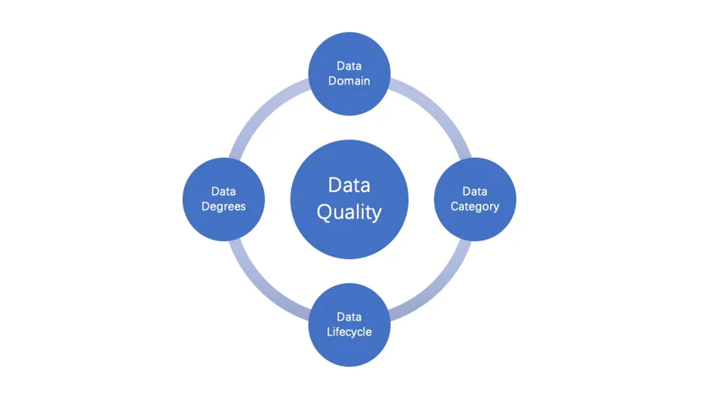
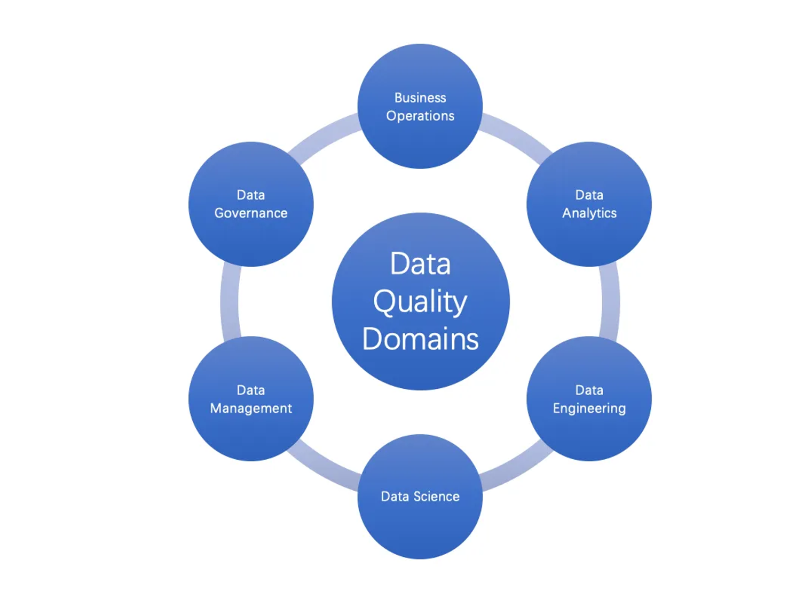

# 【翻译】质量驱动数据宣言
每个数据工程师和数据科学家都应该知道的质量驱动数据宣言

原文：  
Quality-Driven Data Manifesto. Every data engineer and data scientist… | by Luhui Hu | Better Programming
https://betterprogramming.pub/data-quality-e1a8311ce1a2

数据就像海水，浩瀚而不可或缺。

数据至关重要吗？当然重要。今天，每个公司和企业都是数据驱动的。

数据是否重要或有价值？是也不是。正如我们所知，对于机器学习和计算机科学来说，“垃圾输入，垃圾输出”。没有质量的数据可能对业务毫无用处，但处理和管理成本却很高。

现在，“数据至关重要”变成了“数据质量至关重要”。

就像您熟悉的测试驱动开发(TDD)一样，您会发现质量驱动数据(QDD)是不可或缺的。测试驱动开发是现代软件开发、DevOps和CI/CD自动化的核心。同样，质量驱动型数据是数据开发和数据创新的灵魂。

为什么要做？如何做？做什么？

定义数据质量似乎是臭名昭著的。那么如何定义数据质量呢？什么是数据质量？如何从整体上确保质量驱动的数据？

数据质量有很多定义，但大多数都明确地暗示了高数据质量，并且高质量似乎是唯一滴定仪。但是，数据质量可能不等于高质量，尽管它是数据的主要目标。虽然高质量不是所有数据的目标，但是现在没有人可以忽视这个属性。因此，在继续之前，我想发表以下声明:

```
数据质量是数据生命周期中数据的一种状态，可以用程度来定义。
```
我们可以通过细化数据域、类别、生命周期和质量程度来定义数据质量。



## 数据领域
我们在哪里需要数据质量？如果你的答案是所有地方，那么你可能已经学到关于数据的最重要的教训，或者你从来没有认真地使用过数据。

数据质量是特定于领域的，而不是通用的或所有地方。数据质量是敏感的，在六个领域变得有意义：业务操作、数据分析、数据治理、数据管理、数据工程和数据科学。



### 业务操作
对数据的业务操作有两大类：OLTP和OLAP。OLTP的数据通常存储在关系数据库或NoSQL中，而OLAP的数据通常存储在数据仓库、数据湖或数据湖屋中。由于不同的业务需求和技术，对数据质量的期望差别很大。不同之处在于业务和操作的视角和深度。

### 数据分析
数据分析包括商业智能、预测分析等。它使数据能够做出商业决策。数据的准确性、完整性、一致性和及时性对于做出正确的决策至关重要。这些是数据质量的核心。

### 数据工程
数据工程是为数据从创建到处理构建数据系统的领域和原则。它是现代数据栈的基础。数据质量应该是数据工程的一部分。数据质量的努力应该超越准确性、完整性、一致性和及时性。数据工程强调数据可观察性、可发现性和可治理性的重要性。

### 数据科学
数据科学是一个跨学科的领域，它从典型的大型数据集中提取知识，并应用这些数据中的知识和见解来解决广泛应用领域的问题。数据科学是机器学习的核心。数据质量是数据科学的基础。数据血缘、语义和统计已经成为数据科学中数据质量的一流公民。

### 数据管理
数据管理是将数据作为有价值的资源进行管理的学科。数据质量是数据管理的一个领域，主要关注数据使用情况。它的目的是控制数据质量，比如管理数据。另一方面，数据管理的属性和特征从用户的角度影响数据质量。

### 数据治理
数据治理是在数据生命周期中将数据作为资产进行管理的原则。数据治理是一种确保数据安全、私有、准确、可用和使用的机制。数据质量是数据治理的一部分。但是对于组织和非技术人员来说，数据治理将数据质量提升到了技术(例如，数据工程和数据科学)之上。数据治理可以平衡数据质量和合规性(包括安全和隐私)之间的优先级。数据治理可能不得不为了隐私和安全而牺牲数据质量。数据治理可能要求商业语言的准确性和一致性，而不是技术性。

将数据作为资产进行管理可以扩展为数据资产的通用概念。该领域包括作为数字资产的数据共享、交易和交换。例如，使用NFT生成的数据是可以在元空间中使用的数字资产。这里的数据质量关注唯一性、身份和完整性。

## 数据类别
定义数据质量取决于业务和应用程序需求。根据经验，它更多的是业务驱动，而不是技术驱动。这意味着质量与业务需求有关。否则，数据质量将变得苍白无力。

在不同的数据类别(如零售、制造、物流、医疗等)中，对数据质量的预期和定义应有所不同。由于每个类别的唯一性，它可以根据数据分类和遵从性进一步细化。

例如，DeepMind的AlphaFold是具有巨大数据的蛋白质结构的突破性进展。亚马逊零售也有大量的运营和分析数据。但是两者对数据质量的范围和期望在及时性、完整性、可治理性等方面是不同的。

## 数据生命周期
在数据生命周期中，数据质量期望是否始终不变?

任何数据都有从创建到收集、使用和处理的生命周期。在生命周期中，越早质量驱动的数据就越好。然而，需求和数据质量覆盖范围应该在不同的生命周期阶段有所不同。在大多数情况下，数据质量在使用阶段变得至关重要或有意义。这并不意味着我们不应该关心数据核化的数据质量，或者我们不应该在整个生命周期中保持相同的高质量。

但是我们应该理解数据质量的目的。在工程设计中必须牢记这一点，并遵守规范。

例如，亚秒级的时效性对于制定可伸缩性决策或在使用数据的零售网站上提供友好的用户体验至关重要。但是，对于以后归档相同的数据，可能没有必要使用相同的标准。

## 数据质量
数据质量可以用程度来定义。我喜欢用度来表示，而不是度量或维度，因为它需要定性或定量。而且，数据质量具有更强的度可测性、度可计算性、度可解析性、度间相关性和度累积性。数据质量的度有两个层次：质量基础度和质量高级度。

### 质量基础度
数据质量基础度是必不可少的。有四个基本的质量等级：准确性、完整性、一致性和及时性。

1. 准确性：定义的准确数据，包括数据内容(或值)、精度和元数据，尽管我们经常忘记精度和元数据。
2. 一致性：跨引用、管道、沿袭、系统和组织的相同定义的数据。
3. 完整性：没有缺失的记录或值。但对于深度学习中的一些大规模稀疏数据来说，这可能是另一回事。
4. 时效性：最新的数据和及时的服务反馈。它对大数据和机器学习变得越来越重要。

### 质量高级度
数据质量高级度也是必不可少的，但最近才出现，或者更适合某些特定领域。有九个高级质量度:唯一性、有效性、相关性、有效性、可观察性、可发现性、可治理性、语义和完整性。随着时间的推移，它可以根据数据域和类别进行扩展。

1. 相关性：满足业务需求的相关数据。
2. 有效性：考虑数据量、种类和速度，数据处理和机器学习的数据有效性。
3. 语义：数据集、列、行甚至记录的语义信息。这个度可以扩展数据来源、血统和关系的语义。
4. 唯一性：数据唯一性是将数据集中或数据集中所有记录的重复和重叠最小化的程度。
5. 有效性：数据有效性是指数据值符合业务规则的程度。它与准确性或完整性不同。
6. 可观察性：与可见性、监控和调试相关的数据可观察性的能力。内置的数据统计和度量应该是其中的一部分。越来越多的现代数据云解决方案首先支持这一点。例如，Delta Lake计算一些统计数据，并在保存期间将它们附加到数据中，就像Apache Parquet一样。
7. 可发现性：与易于集成、共享和使用相关的数据可发现性能力。
8. 治理性：强调数据遵从性的数据治理的成熟程度。
9. 完整性：数据完整性的程度。该术语似乎与基本的准确性和一致性重叠，但它强调了防止数据损坏的数据生命周期。

## 总结
质量驱动数据(QDD)是一种数据获取、使用和处理原则。有了它，我们可以按程度定义数据质量，提高决策和机器学习质量，并提前预防意外问题。数据质量是在数据域和数据类别的上下文中确定的。有两组质量度可以从整体上定义数据质量。

所以，数据质量是复杂但可执行的。在数据生命周期和类别方面，按程度定义是合理的。它可以通过质量驱动的数据实践或质量作为基础设施，通过与数据治理或其他数据域的集成来有效地实现和改进。