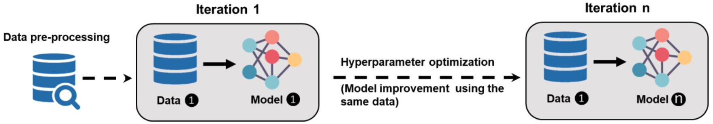
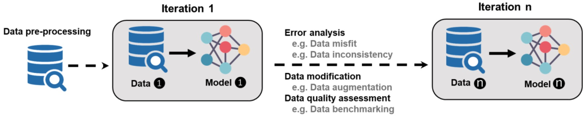

# 【翻译】DCAI的6项原则

原文：  
The Principles of Data-Centric AI (DCAI)
https://arxiv.org/pdf/2211.14611.pdf

## 摘要
数据是人工智能(AI)系统学习的关键基础设施。然而，到目前为止，这些系统在很大程度上是以模型为中心的，以牺牲数据质量为代价来增加模型的价值。数据质量问题困扰着人工智能系统的性能，特别是在下游部署和实际应用中。以数据为中心的人工智能(DCAI)作为一个新兴概念，通过迭代和系统的方法，将数据，及其质量和动态带到人工智能系统研究的最前沿。作为第一批综述论文之一，本文汇集了以数据为中心的观点和概念，概述了DCAI的基础。具体工作为研究人员和实践者制定了6条指导原则，为DCAI的未来发展指明了方向。

## 介绍
数据及其质量在支持人工智能系统中的作用越来越突出，从而产生了以数据为中心的人工智能(DCAI)的概念，它脱离了广泛的以模型为中心的方法。围绕DCAI的热烈讨论可以归功于人工智能先驱吴恩达(Andrew Ng)最近发起的一项运动。DCAI是围绕提高人工智能项目数据质量的关注和努力的结晶。DCAI可以被理解为一个新兴术语，指的是之前围绕数据质量的大量实践和研究工作，这些实践和研究工作补充了结构化框架，如以人为中心的数据科学[4,5]。因此，“数据工作”本身的性质并不一定是新的[35]。然而，多年来，人工智能项目中的实际数据工作主要来自个人计划，和来自零碎和特别的努力。缺乏对数据卓越性和数据质量的关注导致人工智能系统的结果不尽如人意，特别是那些部署在高风险领域(如医疗诊断)的系统[35]。DCAI放大了数据在整个人工智能生命周期中的作用，并延长了其生命周期，超出了以模型为中心的人工智能中所谓的“预处理步骤”。以模型为中心的人工智能的主要目标是通过优化给定模型的学习参数和超参数来提高模型性能。模型的可感知和可衡量的成功来自算法的设计和实际模型的复杂程度，而不是用于构建和验证模型的数据。在开发人工智能系统时，以原型模型为中心的方法几乎没有给系统地、逐步地修改和提高数据质量留下机会[5]。数据准备仅在开始时执行，并通过ML(机器学习)中的“预处理”步骤，建立数据质量的静态方法。处理数据问题(例如，数据噪声)的负担主要取决于模型(图1)。演示了数据集如何在整个生命周期中保持基本不变)。这可能反映了人工智能社区中普遍存在的“数据冷漠”规范，该规范隐含地将数据的作用降级为仅仅是模型训练的燃料[20]。数据冷漠可能导致“数据级联”，作为复合事件，在下游人工智能部署中产生负面和不可预测的后果[35]。

图1:以模型为中心的AI的生命周期原型

在过去的几年里，通过开源社区深度学习模型的民主化，以及付费API的兴起，为更容易访问不同领域的许多优化模型提供了前所未有的机会。即使取得了这些进展，数据的零碎质量控制仍然是一个棘手的问题[27]。因此，对数据的最新关注是由模型的相对改进驱动的，一个可能的原因是，研究人员和开发人员现在有更多的带宽来处理数据问题。更重要的是，人工智能在现实环境中越来越多的应用表明，数据往往是“混乱的”，因此，如果没有严格的质量控制制度，这些数据集的集成可能会导致“垃圾输入，垃圾输出”的问题[5]。关注数据及其上下文特异性(而不仅仅是模型)可以帮助将人工智能模型推广到更多的领域，使这些模型能够解决更复杂的现实问题。

## DCAI
DCAI提倡采用系统和迭代的方法来处理数据问题。DCAI的基本前提是人工智能应用程序是动态的，训练和维持它们的数据集也是动态的。从DCAI方法设计的模型识别并努力捕捉数据的动态，作为人工智能系统中不断发展的基础设施。数据是全面的人工智能系统的支柱[39]，但DCAI的应用在人工智能研究和实践的前沿之外更为重要。我们认为DCAI方法不仅适用于能够访问超大数据集的大型科技公司(例如谷歌和Facebook)，也适用于训练样本通常较小(例如制造业)或由于不同类型的监管或实际限制(例如医疗保健法规)而难以产生的行业和用例。

在DCAI方法中，人工智能系统的有效性是基于模型的性能和与模型交织在一起的数据的质量来评估的。数据和模型都是通过多次迭代来评估和改进的(参见图2)。这些迭代可以从最初的训练到生产中的部署。每次迭代(重新)训练和细化模型，并提高数据质量。

图2:以数据为中心的AI迭代生命周期，整合数据改进

在每次迭代之后，需要采取三个典型步骤。在第一步中，团队开始进行错误分析，以根据数据拟合(数据如何有效地帮助训练基于手头实际问题的准确表示的模型)和数据一致性(数据注释的准确性和一致性)确定错误的来源。第二步使用错误分析的结果，查看数据中的错误来源，并实现克服这些缺陷或改进机会的方法。例如，数据增强是一种通过引入合成数据来使数据采样方法多样化来提高数据拟合度的策略[23]。

第三步涉及对数据质量的系统评估，可以将数据基准作为主要方法。数据基准测试广义上是指在两个连续迭代中比较训练集和测试集数据质量的策略。有效的数据基准测试策略的例子有:   
(1)无监督学习方法，揭示数据不匹配，如数据不平衡和异常检测，例如[1];   
(2)使用无监督算法将降维应用于基准非结构化数据(如图像和序列)，例如[6];   
(3)受数据库系统启发的数据验证技术，用于推导适合人工智能系统的数据质量指标，例如[8];最后   
(4)监测AI模型本身性能的改进，这是开发AI系统中数据质量的最终衡量标准[26]。    

在接下来的内容中，我们通过汇集已经存在但分散的数据概念和实践，特别是以人为中心的人工智能和以人为中心的数据科学的最新发展，提供了DCAI的六个指导原则的制定[4,38]。这些原则(特别是原则4和原则5)认识到，数据是一种社会技术结构:由人类创造、操纵和解释，因此，以人为中心的方法对于理解通过模型翻译的数据的含义至关重要，从而减轻潜在的偏见和不可预见的后果。这里提出的六个原则并不是对人工智能中与数据卓越相关的所有问题和解决方案的全面阐述，而是对新兴空间和DCAI概念的启发。

## 原则1:系统地改进数据拟合

DCAI中数据的使用是战略性的，这意味着数据本身并不提供价值，而是被视为解决特定问题和目标(主要由领域专家决定)以及改进模型(主要由AI专家决定)的一种手段。因此，数据的最终价值在于与模型和算法的耦合，服务于各个利益相关者[20]。在此背景下，数据拟合的概念包含了数据支持和充分覆盖模型的程度，以适应人工智能系统的真实世界背景的独特特征，并提供了该背景的代表性样本[33]。例如，数据拟合包括足够的覆盖率(例如，要覆盖的重要变量)和数据平衡(例如，来自每个类的样本数量均匀分布，并且没有可能对模型性能产生不利影响的偏差)。

改善数据契合度的主要数据实践是从定义和收集(新鲜的、新的)数据转向随着迭代的进行而增加数据。每次迭代后，DCAI团队可能会检查是否需要1)清理和更好地准备现有数据，2)通过数据增强生成合成数据或3)收集新鲜和新的数据[29]。第一次创建数据集时的最佳实践是识别数据中的偏差来源。随机数据采集可能导致案例或事件的数量和类型不平衡，产生不具代表性的样本或数据中难以复制的现象。这些困难的例子通常被认为是人工智能系统的根本缺陷(即，那些只能被人类识别而不能被当前训练模型识别的例子)。例如，随机收集ICU的患者记录以检测医院的继发感染，结果是大多数未感染的患者病例和少数继发感染的患者。这种数据失衡可能会在模型中引入假阴性误差偏差，预测病例未被感染。为了获得足够的数量以进行有效的分析，对代表感兴趣现象的案例进行过度抽样可能更加昂贵和耗时。出于这个原因，在人工智能项目的范围界定阶段识别潜在的少数群体可以提高数据集的质量。

一个相关的问题是，在最初的数据采集过程中，一些困难的例子可能不清楚，直到通过对训练模型的错误分析才会发现。最佳的模型训练需要观察额外的数据，以更好地识别困难的例子。数据增强是一种通过对硬样本进行过采样并创建平衡数据集来使数据多样化的策略[3]。例如，语音识别中常用的各种图像变换(剪切、扭曲、旋转等)和切片等增强技术来创建合成硬样例[30]。生成对抗网络(GAN)正在成为一种有用的工具，用于揭示和合成更困难的例子[15,28]。

## 原则2:系统地改进数据一致性

如前所述，DCAI中数据质量的定义指标之一与数据的准确性或一致性有关，而不是数据的绝对数量(即大数据)。准确性是指注释与黄金标准一致的程度[21]，换句话说，就是注释反映它们应该反映的内容有多准确。作为一个密切相关的概念，数据一致性指的是跨注释者和跨时间遵守相同的注释过程。

自动化工具的采用现在促进了注释的一致性，这是一个劳动密集型和耗时的过程。弱监督标记工具通过提供伪标签来提高图像注释的速度和一致性。例如，在实例分割的情况下，在对象周围绘制矩形比用多边形绘制其精确轮廓更容易。然后，无监督算法(如Grabcut)可以使用弱标注的矩形边界框来帮助生成物体轮廓[34]。

即使随着自动化工具的兴起，注释仍然是一个需要人工参与的过程，这带来了内在的注释器间一致性问题。在学术研究中，“编码间可靠性”的概念早已被用于数据编码[25]。同样的方法可以用于确保训练数据的一致性，其中标注结果及其一致性是定量测量的。相关系数的kappa系数等一致性度量可以用作多个注释者之间一致性的度量[21]。

DCAI优先考虑实现过程以增强数据一致性。在每次迭代期间，围绕一致性的对话和协议将有助于使整个团队保持一致，并且必须为涉及数据注释的人员(特别是新手)提供文档和微调一致性标准和指导方针。这些说明可以揭示边缘、模糊或边线情况，并将它们用作澄清注释约定和良好实践的方法。例如，DCAI团队可以建立在诸如门控指令(Gated Instruction)之类的协议之上，该协议交互式地教授注释任务，评估它们的输入，并提供错误反馈，确保注释者获得了与手头任务相关的足够能力[24]。

除了注释者之间的一致性之外，其他相关的文档实践还包括系统地生成和记录关于数据集的元数据。数据从来不是原始的[4]。多年来，研究人员一直强调数据来源或数据血缘的概念，将其作为跟踪和记录数据起源及其随时间演变的过程[9]。最近，在人工智能系统的背景下，开发了“数据集数据表”来指导关于数据集的关键元数据的文档，例如数据集创建背后的动机、收集过程、分发过程和推荐用途。这种做法还促进了多个利益相关者之间的沟通，并有可能提高人工智能系统的透明度[16]。

## 原理3:模型和数据通过迭代相互改进

回想一下图2中描述的迭代概念。每次迭代后对模型进行错误分析，确定与模型性能相关的哪些数据子集是可接受的或不可接受的，因此，有助于确定数据修改的下一个迭代。例如，错误分析可以显示更明显地扭曲模型性能的数据子集，因此，在下一次迭代中重新训练模型之前，需要精确地解决数据问题(例如，注释不一致)。当在数据中检测到偏差的来源时，可以重新设计带有这些偏差集的数据切片，以提高与这些问题相关的模型的性能。例如，MLflow[11]和DVC(数据版本控制)[12]等开源框架可以长期监控和维护ML模型及其相应的数据集。

在DCAI中，数据收集不是在一个步骤中全部完成的(就像在以模型为中心的AI方法中一样)，它被认为是更有针对性的（基于模型数据性能考虑的），更重要的是，通过集成其他实际示例的多次迭代不断更新。例如，加入社交媒体上的错误信息或欺诈性金融交易的新实例[33]会导致模型的改进超出人工智能系统的初始生产部署。

机器学习模型操作化管理(MLOps)是人工智能部署中一组关键的紧急最佳实践，专注于对已部署模型的持续监控以及为更新模型而提供的反馈。对概念漂移或数据漂移等问题进行监控，并将结果(例如，预期结果数据可能是什么样子)反馈到下一次迭代中，以重新训练模型并改进数据[29]。概念漂移是指输入和输出变量之间关系的变化。概念漂移的一个例子是由于不可预见的变量(如季节性)而导致的在线购物模式的变化。在部署后一段时间内监视模型的表现是一种揭示概念漂移的策略。数据漂移是指输入数据分布的变化。数据漂移的一个例子是面部识别算法，该算法是在白人面部上训练的，在部署模型时不能有效地检测到其他肤色的面部。结合降维技术(即PCA、t-SNE、UMAP)对数据点进行连续聚类分析是检测数据漂移的有效策略[6]。

因此，DCAI迭代的一个主要结果是通过相互调整来改进模型和数据。有了DCAI，不仅数据得到改善，而且模型通过在输入数据和输出目标之间建立更好的关系以及对未见数据更好的泛化来适应和提高其性能。

## 原则4:“数据工作”以人为本

最近转向以数据为中心的方法为重新关注为人工智能系统提供动力的数据中人类背景的代表性提供了机会[39]。以人为中心的数据科学是一个新兴领域，它批判性地分析了隐含但普遍存在的假设，即“如果(数据)足够大，它将告诉我们一切”，以及“人的因素[可以]从数据库中清除”[4,9页;31页]。相反，数据被视为人类的责任和努力，因为人类参与了数据工作的每一步，他们的选择会对在构建人工智能模型时道德和负责任地使用数据产生影响。

数据工作是指塑造数据的基本人类活动，例如获取、设计、整理和改进数据[4]。以人为中心的研究表明，数据工作通常由“数据愿景”指导，其中包括形式化的计算方法和标准化格式(通常与正式培训相关)，以及可自由支配的工艺和定位的变通方法/修复(通常与数据科学的现实世界实践相关)，以适应手头数据背景的独特偶然性[31]。由于对优化模型和算法的传统工作的关注，数据工作往往是不可见的和不被重视的。如果DCAI方法要提高数据质量(作为当今人工智能系统的瓶颈)和模型对人类的影响，它们需要超越“数据作为单调的工作”，并通过有目的的实践，如系统的数据文档、在DCAI生命周期中建立的反馈渠道，以及与领域专家和领域合作伙伴的持续对话，来引起对数据卓越性的关注[35]。

此外，以人为中心的数据科学清楚地表明，数据不应该被理解为客观和上下文无关。数据不可避免地嵌入到一个环境中，与开发、使用和解释它的人是不可分离的(使其成为关系和设计活动和选择的问题)[14]。因此，人工智能系统的数据反映了重要的个人和社会主观(有时未记录)决策，例如“什么是数据?”，“从数据中排除的异常值是什么?”，以及“什么是基础真实数据?”。使数据工作进一步复杂化的一个因素是，这些问题可能是基于独特的政治动态和占主导地位的社会技术价值体系来处理的[32]。像“路灯效应”这样的偏见也会对数据科学家如何选择和处理数据源造成明显的限制。例如，数据科学家可能会使用易于获取且易于转换为相对干净的训练集的数据集，而不是提出好的问题并阐明需要探索的内容，我们称之为原则1下的策略性数据使用[4]。为了注意这些数据的上下文和以人为中心的维度，DCAI团队需要对“数据”采取批判性的观点，并探索和捕获不同的用户行为。这种批判性的视角可以让我们更深入地了解AI系统要解决的问题，同时减轻系统的负面后果(例如，决策偏差和歧视)[4]。

批判性视角还可以帮助发现和纠正数据和模型问题。机器学习工程师可能经常以收集“干净”的数据集为目标，这些数据集没有异常值，也就是所谓的“噪声”，以提高模型性能[39]。这种冲动可能会导致“过度拟合”，当模型通过去除现实应用程序中存在的特征而过度拟合时，这不可避免地降低了数据的代表性。除了可能源于数据采样方法的这些类型的偏差之外，特定的建模决策也可能引入偏差。例如，选择保留、更改或丢弃的参数可能是导致系统性能偏差的罪魁祸首。防止此类问题不仅需要计算和数学能力，还需要对正在开发的特征所在领域的上下文知识[4]。这让我们回到了让更了解使用环境的涉众参与进来的重要性(更多信息请参见原则6)。为此，帮助与人类利益相关者沟通数据和系统性能的工具是至关重要的(例如，数据可视化和/或可视化分析)。 

## 原则5:AI是一种社会技术系统

人工智能系统越来越多地影响着数百万人的生活，并被用于刑事司法、医疗保健、人力资源管理和教育等领域。但算法很难是中立或客观的，它依赖于用户的目标和洞察力。以人为本的人工智能将这些组合呈现为复杂的社会技术系统，既体现了技术元素，也体现了社会规范、价值观和偏好[10,13]。与DCAI方法类似，以人为中心的人工智能认为，开发工作必须超越人工智能模型的工程优化，并拥抱人类的需求，旨在以道德敏感的方式增强(而不是取代)工程优化[38,39]。这需要特定的设计框架和策略，以确保人工智能系统的设计符合道德规范，满足不同利益相关者(特别是边缘化和弱势群体)的需求。伦理考虑的例子包括尊重人们的隐私权，提供公平分配的利益，以及遵守关于人们数据权的不同法律框架[4]。

在以人为中心的人工智能中，目标不仅是提高自动化效率(这可能以牺牲传统框架中的人类代理为代价)，而且还要提高人类的表现，促进他们的能力和责任。因此，设计框架必须旨在赋予人类驾驭和控制自动化系统的能力，以更有效地行使代理和创造力。这就需要能够帮助用户和开发者就AI系统的目标和功能达成共识的策略。例如，执行审计跟踪并始终如一地从用户那里征求关于人工智能系统状态的细粒度反馈[38]。因此，以人为本的人工智能的一个关键任务是打开“人工智能的黑盒子”，使人工智能系统对人类来说是可解释和可理解的[13]，例如帮助人类操作员理解人工智能系统能够做什么以及为什么人工智能系统以某些方式运行[2]。

在未来的DCAI团队中，人机交互(HCI)或用户体验(UX)专家可以通过集成以人为中心的输入和评估人类行为和实际需求来发挥关键作用。以人为中心的设计或以人为中心的数据方法(例如，最终用户数据探测或捕捉人类使用背景的故事板)为系统地整合最终用户的兴趣和需求以及为AI、HCI和领域专家之间的合作建立共同基础提供了急需的视角[39]。

## 原则6:人工智能和领域专家之间的持续和实质性互动

人工智能模型的数据越来越复杂、多维、依赖于应用程序/问题。因此，支持人工智能模型的最有效的数据集是通过人工智能工程师和领域专家之间的合作伙伴关系定制的[29]，这些专家了解操作的细微差别以及他们自己独特背景下的质量标准。例如，在医疗保健和医疗环境中，考虑到隐私和遵从性框架，通常很难获得患者数据。因此，严格的监管协议(例如，美国的HIPAA患者权利)被附加到这些领域的数据实践和数据治理中。这需要领域专家的持续参与，这些专家从事实用的数据收集和评估，甚至评估模型是否实现了预期的目标。领域专家通过开发特定的用例来增强评估过程，这些用例将模型放入对领域更敏感的测试中[37]。领域专家不仅有助于数据收集和准备过程，还有助于解释由此产生的人工智能模型[27]。

认真对待数据意味着更认真地对待数据注释者和领域转件之间的关系。相比之下，最近的研究表明，许多AI开发人员认为注释者是“不必要的”，并不一定重视他们的专业知识和贡献[36]。Bernstein建议将思维方式从“注释即服务”（这意味着与注释者之间的短暂关系）转变为“注解者即合作者”（这需要对数据训练采取实际操作方法，并与数据注释者建立更长期、更实质性的关系[7]）。为此，在模型训练中实现数据一致性的一个关键方法是人工智能专家和负责注释数据的个人之间的清晰对话。例如，多个冲突的标签约定，特别是在复杂和隐性任务的情况下，可能会混淆数据质量，从而有降低人工智能模型表现的风险。AI专家必须清晰、持续地向领域专家和数据注释者传达他们的意图，并努力在每次迭代中为他们提供增量反馈[7]。

## 未来的方向和步骤

在最后一节中，我们讨论了可以推进DCAI的未来方向，并帮助解决人工智能实践中的当前差距。

#### 数据准备和增强

数据准备和质量控制应该成为人工智能团队的核心关注点，而不是事后的想法。这需要在围绕数据来源和数据沿袭等概念已经形成的最佳实践的基础上进行构建。接下来，我们需要创建一个更严格的元数据开发机制。数据改进之前的一个挑战是关于数据本身和模型的来源的数据的可用性，而目前许多研究既不提供数据也不提供代码以进行确认和比较。

未来可能的解决方案可能涉及人类专家和自动化系统在清理和准备数据方面的合作。例如，另一个开源项目[AutoML](https://www.automl.org/)已经为自动化构建ML模型提供了机会。未来的工作可以围绕采用AutoML或类似的方法来帮助DCAI团队关注标签噪声或数据集的覆盖以及连续的数据收集或标签校正[33]。注意到这一点，人类必须保持在循环中。人工检查数据仍将是人工智能专家的关键任务[37]。

#### MLOps团队和工具作为数据质量的集成解决方案

DCAI清楚地表明，数据定义了深度学习系统的行为，而嘈杂或混乱的数据是阻碍人工智能性能的主要罪魁祸首。因此，负责在生产中有效部署和维护人工智能模型的MLOp团队的核心任务必须是处理、处理和监控在系统上线之前和之后训练系统的数据[37]。因此，我们预见MLOps团队和实践将参与DCAI的整个生命周期。因此，随着人工智能系统继续在现实世界的应用中使用，这些团队的范围和责任将扩大，而不仅仅是孤立的实验情况。在这里，软件工程中建立的卓越标准和原则可以为开发数据质量评估框架提供灵感和类似的度量(例如，可维护性和保真度)[5]。

#### 数据偏差和审计程序

人工智能的决策不是中立的。人工智能系统可以反映、强化甚至放大社会偏见。近年来，由于数据集中未发现或未解决的偏见来源，人们对人工智能中的偏见提出了严重的担忧。例如，研究人员发现，非裔美国人在面部照片数据库中的比例过高，因此更有可能被执法部门使用的算法挑出来[22]。鉴于DCAI对数据的关注，DCAI必须包括通过技术解决方案(如反事实测试)或通过操作实践(如价值敏感的设计方法或人工智能模型的第三方审计)来解决数据偏见的挑战。DCAI研究人员和从业人员需要与已经投资于该主题的其他社区合作，开发工具和政策，以帮助检测数据集中可能引入某些不一致的原因，以及为什么数据中的某些属性可能在系统中被过度或未被充分代表。

#### 以人为本的方法

随着人工智能系统越来越多地部署在高风险的决策中，这些系统应该与用户进行持续的交互，并使用上下文来开发更合乎道德、更负责任和更公平的结果。谷歌流感趋势等例子引发了“算法傲慢”的问题，即开发人员对完全自主的端到端系统的愿景掩盖了用户行为的动态性和更广泛的社会背景[38]。谷歌流感趋势系统在两年后被关闭，因为它引起了人们对其预测的意义以及它对真实流感相关模式和行为的准确反映的担忧。

对未经检验的计算持健康的怀疑态度，并强调对人工智能系统以人为中心的观点，有助于解决本文中描述的人工智能系统的负面影响。要做到这一点，可以把重点放在可能在形成、评价和整合数据方面发挥重要作用的人和背景因素上，并提倡采用系统的方法来确定往往相互冲突的价值观和背景。这些方法要求在态度和系统开发、部署、维护实践方面做出关键的改变，以便向多个涉众(包括领域专家、最终用户和受系统影响的人)发表意见。最近在以人为中心的人工智能方面的工作要求超越“用户”的简化隐喻，直接参与诸如“谁是以人为中心的机器学习中的人类”等问题[10]。可以从揭示和合并多个利益相关者价值的框架中获得灵感(例如，价值敏感设计)，以更有效地调查设计权衡，帮助授权所有涉众。

最后，基于人工智能的系统在可用性测试和界面设计方面提出了新的挑战。例如，由于其不可预测和不断发展的性质，这些系统可能会随着时间的推移挑战鼓励界面稳定的一致性原则。因此，需要重新审视设计人类用户交互的原则、指导方针和策略，以适应用户与这些新兴系统的交互[2]。

#### 众包数据供应链

数据标注现在很大程度上依赖于众包工作者。在过去的几年里，这刺激了基于行业的数据注释和标签服务的增长(例如，Amazon Sagemaker Ground Truth和Scale.ai)。目前的一些做法引起了道德和实践方面的关注。最近的研究表明，标注者的不同解释会导致数据标注的不一致，对人工智能表现产生不利影响[17]。机器学习工程师和众包工作者之间的清晰沟通，创建“代码本”，或者由机器学习工程师自己执行一些注释，都是增强数据一致性的重要初始步骤。改善数据供应链的另一个主要方法是对注释数据的众包工作者的体验进行系统改进。近年来的大量研究表明，对这些众包工作者的不公平待遇(例如，无法获得最低工资)以及在微任务平台上实施的严格算法控制等问题可能会造成不稳定的工作环境，从而影响整个数据供应链的可靠性(超出明确和有效的道德问题)[19]。DCAI的努力和项目需要制定策略，通过提供公平的补偿和更有意义的工作体验，改善这些“幽灵工作者”在“人工智能帷幕”背后的生活[18]。

## 结论

正如Aroyo等人[5]简洁地指出的那样，“数据可能是当今人工智能生态系统中最被低估和最不炫目的方面。”如果不重视数据以人为中心的本质，可能会对人工智能系统的结果造成严重的负面影响，比如结果表现上的偏差。DCAI可以将数据在人工智能系统性能中的作用放在首位，并优先考虑数据的质量而不是数据的大小。数据应该被视为以人为中心的、动态的、不断发展的，而不是只在预处理阶段参与的模型的静态输入。因此，改进数据仍然是一个关键的迭代任务，超越了“预处理”的思维方式，而是贯穿整个系统生命周期。在本文中，我们将DCAI作为一个萌芽的运动，并以四项原则的形式将已经存在但分散的数据概念和实践结合起来，以指导DCAI的工作。DCAI的未来在于创建监控和提高数据质量的系统流程，这需要更密切地关注数据的提供、准备、注释和集成到人工智能系统中的方式。

## References

[1] Subutai Ahmad, Alexander Lavin, Scott Purdy, and Zuha Agha. 2017. Unsupervised realtime anomaly detection for streaming data. Neurocomputing 262, (November 2017), 134– 147.

[2] Saleema Amershi, Dan Weld, Mihaela Vorvoreanu, Adam Fourney, Besmira Nushi, Penny Collisson, Jina Suh, Shamsi Iqbal, Paul N. Bennett, Kori Inkpen, Jaime Teevan, Ruth KikinGil, and Eric Horvitz. 2019. Guidelines for Human-AI Interaction. In Proceedings of the 2019 CHI Conference on Human Factors in Computing Systems (CHI ’19), Association for Computing Machinery, New York, NY, USA, 1–13.

[3] Anima Anandkumar. 2021. Data Augmentation. Data-centric AI Resource Hub. Retrieved March 21, 2022 from https://datacentricai.org/data-augmentation/

[4] Cecilia Aragon, Shion Guha, Marina Kogan, Michael Muller, and Gina Neff. 2022. HumanCentered Data Science: An Introduction. MIT Press.

[5] Lora Aroyo, Matthew Lease, Praveen Paritosh, and Mike Schaekermann. 2022. Data excellence for AI: why should you care? Interactions 29, 2 (February 2022), 66–69.

[6] Etienne Becht, Leland McInnes, John Healy, Charles-Antoine Dutertre, Immanuel W. H. Kwok, Lai Guan Ng, Florent Ginhoux, and Evan W. Newell. 2018. Dimensionality reduction for visualizing single-cell data using UMAP. Nat. Biotechnol. (December 2018). DOI:https://doi.org/10.1038/nbt.4314

[7] Michael Bernstein. 2022. Labeling and Crowdsourcing. Data-centric AI Resource Hub. Retrieved March 15, 2022 from https://datacentricai.org/

[8] Matthias Boehm, Arun Kumar, and Jun Yang. 2019. Data Management in Machine Learning Systems. Synthesis Lectures on Data Management 14, 1 (February 2019), 1–173.

[9] Peter Buneman, Sanjeev Khanna, and Wang-Chiew Tan. 2000. Data Provenance: Some Basic Issues. In FST TCS 2000: Foundations of Software Technology and Theoretical Computer Science, Springer Berlin Heidelberg, 87–93.

[10] Stevie Chancellor, Eric P. S. Baumer, and Munmun De Choudhury. 2019. Who is the “human” in human-centered Machine Learning. Proc. ACM Hum. Comput. Interact. 3, CSCW (November 2019), 1–32.

[11] Andrew Chen, Andy Chow, Aaron Davidson, Arjun DCunha, Ali Ghodsi, Sue Ann Hong, Andy Konwinski, Clemens Mewald, Siddharth Murching, Tomas Nykodym, Paul Ogilvie, Mani Parkhe, Avesh Singh, Fen Xie, Matei Zaharia, Richard Zang, Juntai Zheng, and Corey Zumar. 2020. Developments in MLflow: A System to Accelerate the Machine Learning Lifecycle. In Proceedings of the Fourth International Workshop on Data Management for End-to-End Machine Learning (DEEM’20), Association for Computing Machinery, New York, NY, USA, 1–4.

[12] DVC. 2022. Open-source Version Control System for Machine Learning Projects. iterative.ai. Retrieved March 21, 2022 from https://dvc.org/

[13] Upol Ehsan and Mark O. Riedl. 2020. Human-Centered Explainable AI: Towards a Reflective Sociotechnical Approach. In HCI International 2020 - Late Breaking Papers: Multimodality and Intelligence, Springer International Publishing, 449–466.

[14] Melanie Feinberg. 2017. A Design Perspective on Data. In Proceedings of the 2017 CHI Conference on Human Factors in Computing Systems (CHI ’17), Association for Computing Machinery, New York, NY, USA, 2952–2963.

[15] Maayan Frid-Adar, Eyal Klang, Michal Amitai, Jacob Goldberger, and Hayit Greenspan. 2018. Synthetic data augmentation using GAN for improved liver lesion classification. In 2018 IEEE 15th International Symposium on Biomedical Imaging (ISBI 2018), 289–293.

[16] Timnit Gebru, Jamie Morgenstern, Briana Vecchione, Jennifer Wortman Vaughan, Hanna Wallach, Hal Daumé Iii, and Kate Crawford. 2021. Datasheets for datasets. Commun. ACM 64, 12 (November 2021), 86–92.

[17] Mitchell L. Gordon, Kaitlyn Zhou, Kayur Patel, Tatsunori Hashimoto, and Michael S. Bernstein. 2021. The Disagreement Deconvolution: Bringing Machine Learning Performance Metrics In Line With Reality. In Proceedings of the 2021 CHI Conference on Human Factors in Computing Systems (CHI ’21), Association for Computing Machinery, New York, NY, USA, 1–14.

[18] Mary L. Gray and Siddharth Suri. 2019. Ghost Work: How to Stop Silicon Valley from Building a New Global Underclass. Houghton Mifflin Harcourt.

[19] Mohammad Hossein Jarrahi, Saiph Savage, and Matt Lease. 2021. Driving Fairness in Digital Labor Platforms. In Against Platform Determinism Workshop, Data & Society.

[20] Hasan Kurban, Parichit Sharma, and Mehmet Dalkilic. 2021. Data Expressiveness and Its Use in Data-centric AI. In NeurIPS Data-Centric AI Workshop.

[21] Liliya Lavitas, Olivia Redfield, Allen Lee, Daniel Fletcher, Matthias Eck, and Sunil Janardhanan. 2021. Annotation Quality Framework-Accuracy, Credibility, and Consistency. In NeurIPS Data-Centric AI Workshop. Retrieved from https://datacentricai.org/neurips21/papers/49_CameraReady_DCAI2021_tex(8).pdf

[22] Nicol Turner Lee, Paul Resnick, and Genie Barton. 2019. Algorithmic bias detection and mitigation: Best practices and policies to reduce consumer harms. Center for Technology Innovation, Brookings. Tillgänglig online: https://www. brookings. edu/research/algorithmicbias-detection-and-mitigation-bestpractices-and-policies-to-reduce-consumer-harms/# footnote-7 (2019-10-01) (2019).

[23] Youngjune Lee, Oh Joon Kwon, Haeju Lee, Joonyoung Kim, Kangwook Lee, and Kee-Eung Kim. 2021. Augment & Valuate : A Data Enhancement Pipeline for Data-Centric AI. NeurIPS Data-Centric AI Workshop. Retrieved from http://arxiv.org/abs/2112.03837

[24] Angli Liu, Stephen Soderland, Jonathan Bragg, Christopher H. Lin, Xiao Ling, and Daniel S. Weld. 2016. Effective Crowd Annotation for Relation Extraction. In Proceedings of the 2016 Conference of the North American Chapter of the Association for Computational Linguistics: Human Language Technologies, Association for Computational Linguistics, San Diego, California, 897–906.

[25] Matthew Lombard, Jennifer Snyder-Duch, and Cheryl Campanella Bracken. 2002. Content analysis in mass communication: Assessment and reporting of intercoder reliability. Hum. Commun. Res. 28, 4 (October 2002), 587–604.

[26] Peter Mattson and Praveen Paritosh. 2021. DataPerf: Benchmarking data for better ML. In 35th Conference on Neural Information Processing Systems, NeurIPS 2021. Retrieved from https://slideslive.com/38970646/dataperf-benchmarking-data-for-betterml?ref=recommended

[27] Lj Miranda. 2021. Towards data-centric machine learning: a short review. Lj Miranda’s Blog. Retrieved March 15, 2022 from https://ljvmiranda921.github.io/notebook/2021/07/30/datacentric-ml/

[28] Mohammad Motamedi, Nikolay Sakharnykh, and Tim Kaldewey. 2021. A Data-Centric Approach for Training Deep Neural Networks with Less Data. In 35th Conference on Neural Information Processing Systems. Retrieved from http://arxiv.org/abs/2110.03613

[29] Andrew Ng. 2021. A Chat with Andrew on MLOps: From Model-centric to Data-centric AI. Retrieved from https://www.youtube.com/watch?v=06-AZXmwHjo&t=2109s

[30] Andrew Ng, Dillon Laird, and Lynn He. 2021. Data-Centric AI Competition. Data-centric AI Resource Hub. Retrieved March 21, 2022 from https://https-deeplearning-ai.github.io/datacentric-comp/

[31] Samir Passi and Steven Jackson. 2017. Data Vision: Learning to See Through Algorithmic Abstraction. In Proceedings of the 2017 ACM Conference on Computer Supported Cooperative Work and Social Computing (CSCW ’17), Association for Computing Machinery, New York, NY, USA, 2436–2447.

[32] Kathleen H. Pine and Max Liboiron. 2015. The Politics of Measurement and Action. In Proceedings of the 33rd Annual ACM Conference on Human Factors in Computing Systems (CHI ’15), Association for Computing Machinery, New York, NY, USA, 3147–3156.

[33] Neoklis Polyzotis and Matei Zaharia. 2021. What can Data-Centric AI Learn from Data and ML Engineering? arXiv

[cs.LG]. Retrieved from http://arxiv.org/abs/2112.06439

[34] Carsten Rother, Vladimir Kolmogorov, and Andrew Blake. 2004. GrabCut. ACM Trans. Graph. 23, 3 (August 2004), 309–314.

[35] Nithya Sambasivan, Shivani Kapania, Hannah Highfill, Diana Akrong, Praveen Paritosh, and Lora M. Aroyo. 2021. “Everyone wants to do the model work, not the data work”: Data Cascades in High-Stakes AI. In Proceedings of the 2021 CHI Conference on Human Factors in Computing Systems (CHI ’21), Association for Computing Machinery, New York, NY, USA, 1–15.

[36] Nithya Sambasivan and Rajesh Veeraraghavan. 2022. The deskilling of domain expertise in AI development. In Conference on Human Factors in Computing Systems, ACM. DOI:https://doi.org/10.1145/3491102.3517578

[37] D. Sculley. 2022. A Data-Centric View of Technical Debt in AI. Data-centric AI Resource Hub. Retrieved March 14, 2022 from https://datacentricai.org/data-in-deployment/

[38] Ben Shneiderman. 2022. Human-Centered AI. Oxford University Press.

[39] Hariharan Subramonyam, Colleen Seifert, and M. I. Eytan Adar. 2021. How Can HumanCentered Design Shape Data-Centric AI? In NeurIPS Data-Centric AI Workshop. Retrieved from https://haridecoded.com/resources/AIX_NeurIPS_2021.pdf
    